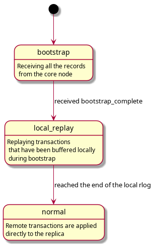
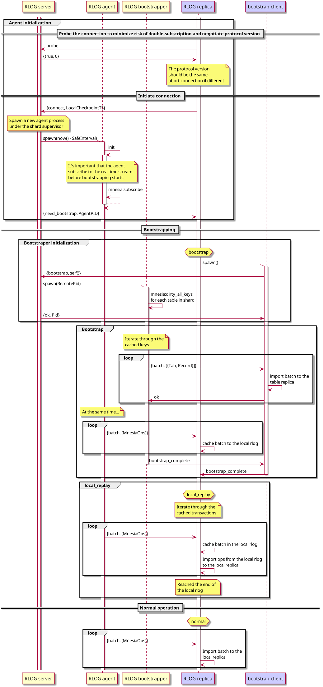

# RLOG: database developer's guide

## Transaction interception

We use a patched version of OTP that allows to hook into post-commit stage of the transaction, after the data has been dumped to the storage.

## Actors

### RLOG Server

RLOG server is a `gen_server` process that runs on the core node.
There is an instance of this process for each shard.
This process is registered with the shard's name.
It is responsible for the initial communication with the RLOG replica processes, and spawning RLOG agent and RLOG bootstrapper processes.
Also it receives the transaction messages intercepted by the hook and multicasts them to the agents.

### RLOG Agent

RLOG agent is a `gen_statem` process that runs on the core node.
This processes' lifetime is tied to the lifetime of the remote RLOG replica process.
It is responsible for subscribing to the mnesia events for the shard and forwarding them to the replicant node.
Each message sent by the agent is tagged with its pid.

#### RLOG Replica

RLOG replica is a `gen_statem` process that runs on the replicant node.
It spawns during the node startup under the `rlog` supervisor, and is restarted indefinitely.
It talks to the RLOG server in its `post_init` callback, and establishes connection to the remote RLOG agent process.
It also creates a bootstrap client process and manages it.

Full process of shard replication:

#### RLOG replica importer worker

`rlog_replica_importer_worker` is a helper process spawned by `rlog_replica` specifically to import batches of transactions into the local database.

This importing is not done in the parent process because it can have a long message queue, which is really harmful for performance of mnesia transactions:
During commit stage, the transaction does a receive without [ref trick](https://blog.stenmans.org/theBeamBook/#_the_synchronous_call_trick_aka_the_ref_trick), so it has to scan the entire mailbox.
The protocol between `rlog_replica_importer_worker` and `rlog_replica` processes has been designed in such a way that the former process never has more than one message in the mailbox, hence mnesia transactions initiated from this process run much faster.

Note that replica sends transactions to the importer worker in batches.
Replica process maintains an internal queue of transactions from the upstream agent, where the messages are accumulated while the batch is being imported by the importer worker.
Once the batch is fully imported, replica process immediately initiates importing of the next batch.

### RLOG bootstrapper (client/server)

RLOG bootstrapper is a temporary `gen_server` process that runs on both core and replicant nodes during replica initialization.
RLOG bootstrapper server runs `mnesia:dirty_all_keys` operation on the tables within the shard, and then iterates through the cached keys.
For each table and key pair it performs `mnesia:dirty_read` operation and caches the result.
If the value for the key is missing, such record is ignored.
Records are sent to the remote bootstrapper client process in batches.
Bootstrapper client applies batches to the local table replica using dirty operations.

## Bootstrapping

Upon connecting to the RLOG server, the replica will perform a process called bootstrapping.
It cleans all the tables that belong to the shard, and spawns a bootstrapper client.

Bootstrapping can be done using dirty operations.
Transaction log has an interesting property: replaying it can heal a partially corrupted replica.
Transaction log replay can fix missing or reordered updates and deletes, as long as the replica has been consistent prior to the first replayed transaction.
This healing property of the TLOG can be used to bootstrap the replica using only dirty operations. (TODO: prove it)
One downside of this approach is that the replica contains subtle inconsistencies during the replay, and cannot be used until the replay process finishes.
It should be mandatory to shutdown business applications while bootstrap and syncing are going on.
